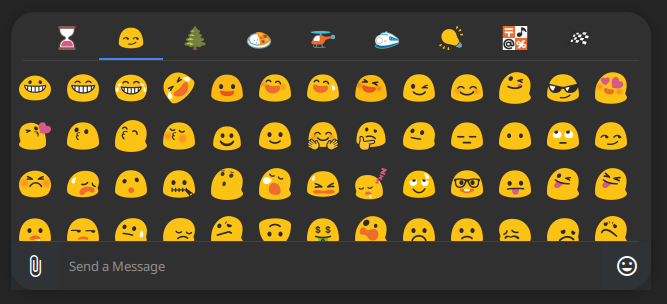

### This is Noto Color Emoji using the original blobs

The older version of the blobs from Google with [C1710's set](https://github.com/C1710/blobmoji) (contains original work) to fill the gaps.

There may be sevaral issues with these as I haven't tested them extensively and C1710's new blobs are subtly different in style so it's a little mixed. I also don't normally do emojis or fonts, so don't trust me to not have screwed something up. 

Aside from the font family name being OGBlobs (rather than Blobmoji) I refer to C1710's repo for instructions on how to build/install/use this, except for Nix(OS) users who can simply install with `nix-env -if ./shell.nix` or add it to your NixOS configuration (`fonts.fonts = [ (pkgs.callPackage ./path/to/blobs {}) ];`).

I welcome feedback and PR's but I don't plan on working on the set personally - I simply wanted these specific blobs.

Blobs are best emojis and OG blobs are best blobs.

